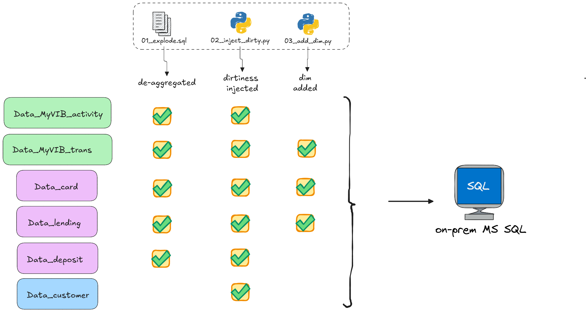

# Data preparation
 
> **This folder is not part of the pipeline.**

Original data is sourced from a Vietnamese banking hackathon (VIB, 2021): [Kaggle dataset](https://www.kaggle.com/datasets/onamihoang/datathon-vib-vn). It is monthly-aggregated, not row-level, so it cannot be used as-is to simulate upstream ingestion.

These scripts reverse-engineer plausible row-level records from the aggregates, inject realistic dirty patterns, and load the result into on-prem MS SQL Server, from where ADF ingests it into the landing layer, as it would in production.

---
 
## Flow
 
```
source/ (VIB data imported to MS SQL)
  ↓ 01_explode.sql       set-based de-aggregation → export SELECT results as CSV
exploded/                row-level, clean
  ↓ 02_inject_dirty.py   probabilistic dirty injection
  ↓ 03_add_dim.py        append dimensional columns
ready/                 row-level, dirty, enriched  →  import to MS SQL
```


 
---

## Scripts
 
### `01_explode.sql` - Aggregated → Row-level
 
Source data is monthly-aggregated (e.g. `COUNT_OF_LOAN = 2`). Explosion uses a tally table join to generate one row per unit (entirely set-based).
 
Run inside SSMS or `sqlcmd` against the database holding the source tables. Each section ends with a `SELECT *`; export those results as CSV into `./exploded/`.
 
| Table | Exploded on | Notes |
|---|---|---|
| Data_customer | n/a | Already row-level, no explosion |
| Data_deposit | `COUNT_CA_ACCT`, `COUNT_TD_ACCT` | Individual balances spread ±15% around `AVG_CA_BALANCE` / `AVG_TD_BALANCE`; originals kept for reconciliation |
| Data_card | `COUNT_CREDITCARD`, `COUNT_DEBITCARD` | n/a |
| Data_lending | `COUNT_OF_LOAN` | Amounts spread ±15% around `AVG_LOAN_AMOUNT` |
| Data_MyVIB_Activity | `ACTIVITY_NO` | Timestamps spread evenly across snapshot month |
| Data_MyVIB_Transaction | `TRANS_NO` | `TRANS_AMOUNT` split via Dirichlet; original total preserved as `TOTAL_TRANS_AMOUNT` for validation |


### `02_inject_dirty.py` - Inject dirty patterns
 
Takes clean exploded CSVs; injects data quality issues that appear in real banking upstream systems. All columns handling dirty values must stay as `object` dtype (no int64/float64 casting) to accept mixed-type assignments.
 
```bash
python 02_inject_dirty.py --input_dir ./exploded --output_dir ./landing
```
 
| Table | Dirty patterns injected |
|---|---|
| Data_customer | ~2% duplicate rows; mixed `CLIENT_SEX` formats (`M` / `Male` / `1`); inconsistent `DATE_OF_BIRTH` formats (6 variants); ~1% null `IB_REGISTER_DATE` |
| Data_deposit | ~1.5% zero balance on active accounts; ~0.5% negative balance |
| Data_card | Mixed `STATUS` casing (`Active` / `active` / `ACTIVE`); ~0.5% orphan cards with no matching customer |
| Data_lending | ~1% null `LOAN_AMOUNT`; ~0.5% future `DISBURSEMENT_DATE`; ~0.5% negative `LOAN_AMOUNT` |
| Data_MyVIB_Activity | ~2% null `ACTIVITY_NAME`; ~1% invalid `ACTIVITY_HOUR` (e.g. 25); ~1% late-arriving records |
| Data_MyVIB_Transaction | ~3% non-positive `TRANS_AMOUNT`; ~1% mismatched `TRANS_LV1`/`TRANS_LV2`; ~0.5% null `TRANS_HOUR` |


### `03_add_dim.py` - Append dimensional columns
 
Adds columns that simulate attributes a real upstream system would provide. Applied after dirty injection, on the output of `02_inject_dirty.py`.
 
```bash
python 03_add_dim.py --input_dir ./landing --output_dir ./landing
```
 
| Table | Columns added | Notes |
|---|---|---|
| Data_MyVIB_Transaction | `CURRENCY`, `ORIGINAL_AMOUNT`, `FIN_INST_ID`, `FIN_INST_NAME` | 15% of rows flagged as foreign-currency (USD/EUR/GBP at fixed mid-market VND rates); `FIN_INST_*` populated only for Outside_VIB transactions, null otherwise |
| Data_card | `CARD_SUBTYPE`, `BRANCH_CODE`, `BRANCH_NAME` | Credit cards only; null for debit rows |
| Data_lending | `LOAN_TYPE`, `BRANCH_CODE`, `BRANCH_NAME` | `LOAN_TYPE` sampled from weighted distribution; branch from `list_branch.csv` |
 
Reference files used: `list_bank.csv` (`FIN_INST_ID`, `FIN_INST_NAME`), `list_branch.csv` (`BRANCH_CODE`, `BRANCH_NAME`).

---
 
## Why SQL for explosion, Python for dirty injection?
 
The original explosion script used pandas `iterrows()` (at ~1.2M source rows), `Data_deposit` alone took 15+ minutes. Since source data already lives in SQL Server, rewriting as a tally-table join runs the same logic in seconds without moving data.
 
Dirty injection stays in Python: SQL Server has no Gaussian distribution, no Dirichlet split, and seeded reproducibility is cumbersome. Since injection runs once on a fixed, bounded dataset, pandas performance is acceptable.
 
---
 
## Reproducibility
 
Both `02_inject_dirty.py` and `03_add_dim.py` use fixed random seeds. The same input produces identical output on every run.
 