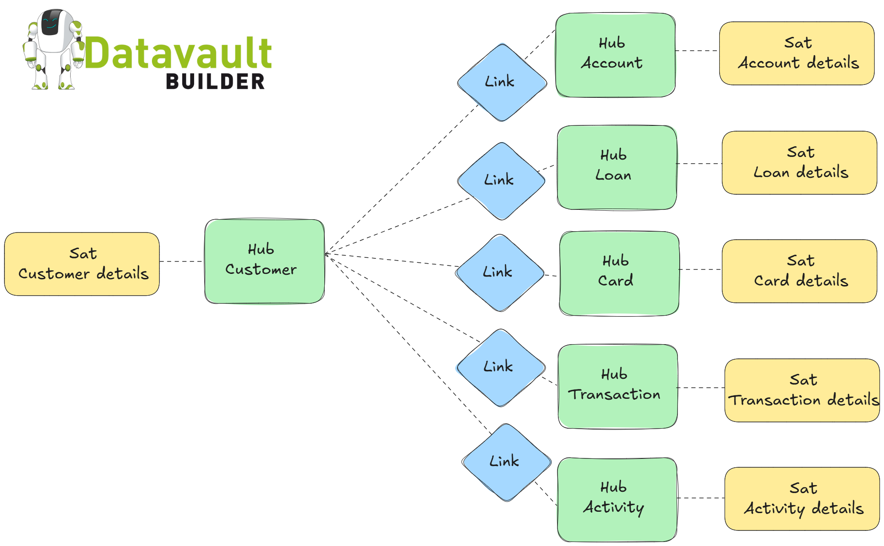
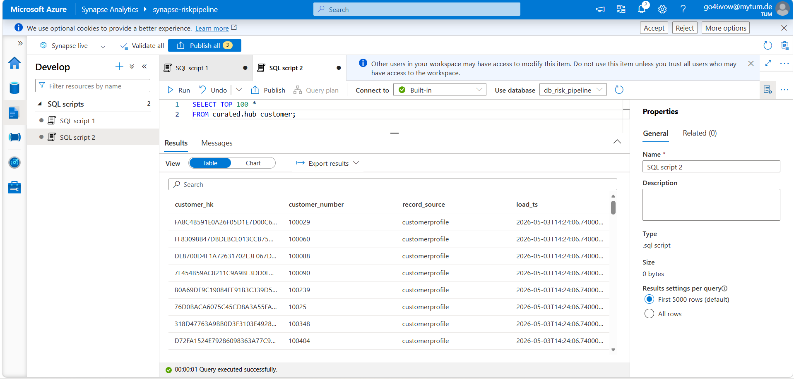
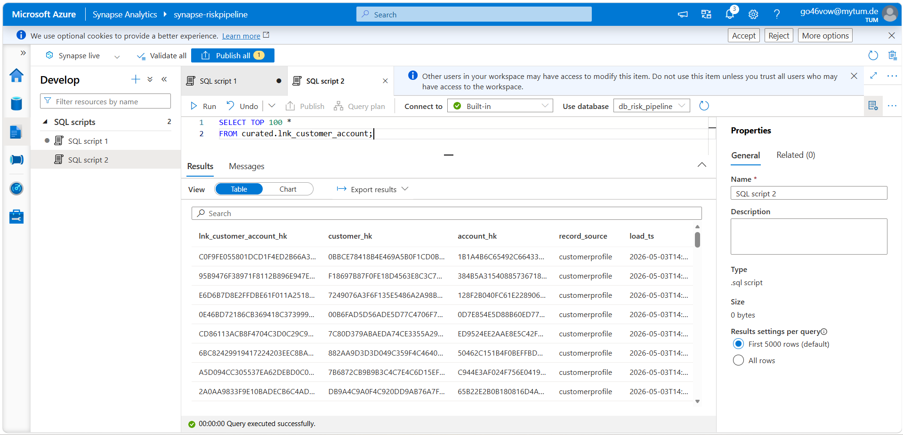
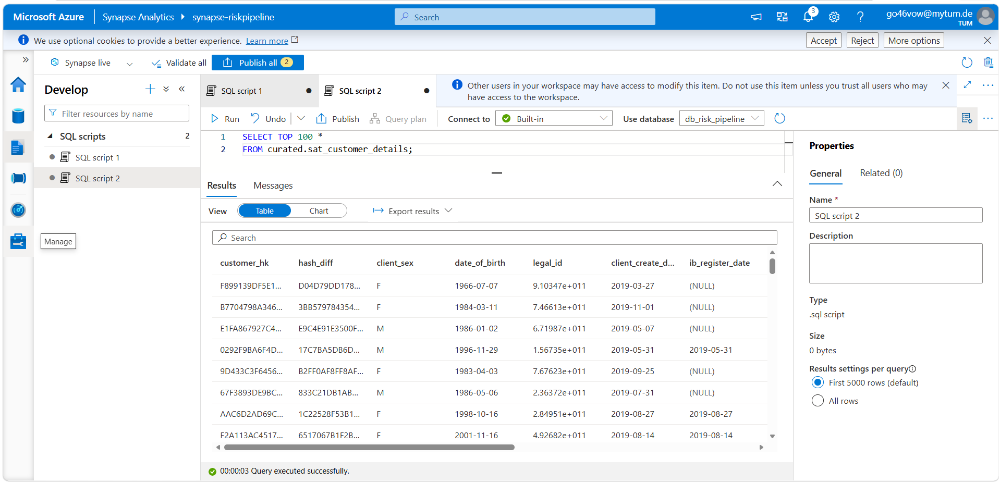
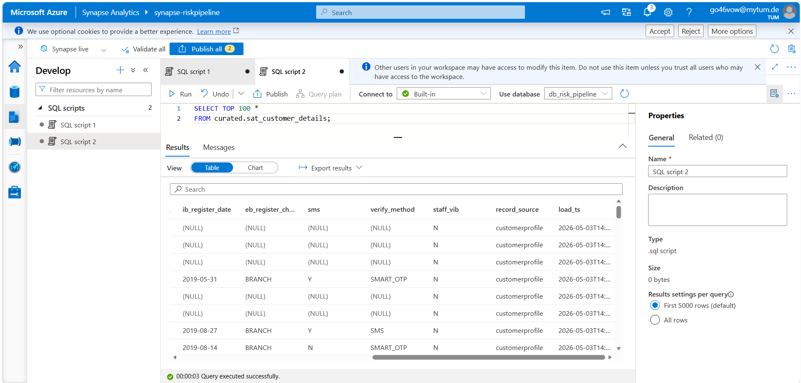

# Overview



# dbt structure
```
models/
├── sources.yml                         ← declares all Synapse external tables
│
├── raw/                                ← materialised as views
│   ├── base_activity.sql   
│   ├── base_card.sql            
│   ├── base_customer.sql               ← cast + rename only
│   ├── base_deposit.sql
│   ├── base_lending.sql
│   └── base_transaction.sql
│
├── curated/                            ← materialised as incremental tables
│   ├── hubs/
│   │   ├── hub_account.sql
│   │   ├── hub_activity.sql
│   │   ├── hub_card.sql
│   │   ├── hub_customer.sql
│   │   ├── hub_loan.sql
│   │   └── hub_transaction.sql
│   ├── links/
│   │   ├── lnk_customer_account.sql
│   │   ├── lnk_customer_activity.sql
│   │   ├── lnk_customer_card.sql
│   │   ├── lnk_customer_loan.sql
│   │   └── lnk_account_transaction.sql
│   ├── satellites/
│   │   ├── sat_account_details.sql    
│   │   ├── sat_activity_details.sql    
│   │   ├── sat_card_details.sql        ← cleaning: score range, future dates
│   │   ├── sat_customer_details.sql    ← cleaning: sex codes, DOB, dedup
│   │   ├── sat_loan_details.sql
│   │   └── sat_transaction_details.sql
│   └── schema.yml                      ← data tests for all curated models
│
├── mart/                               ← materialised as tables
│   ├── dimensions/
│   │   ├── dim_account.sql
│   │   ├── dim_customer.sql            ← SCD Type 2 from DV satellites
│   │   └── dim_date.sql                ← generated date spine
│   ├── facts/
│   │   ├── fact_card_snapshot.sql
│   │   ├── fact_loan_snapshot.sql
│   │   └── fact_transactions.sql
│   └── schema.yml
│
└── macros/
│   ├── generate_hash_key.sql           ← MD5 hash key + hash diff macros
│   ├── generate_schema_name.sql  
│   ├── synapse_incremental.sql  
│   └── synapse_test.sql           
```

# Synapse structure
```sql
SELECT TABLE_SCHEMA, TABLE_NAME, TABLE_TYPE
FROM INFORMATION_SCHEMA.TABLES
ORDER BY TABLE_SCHEMA, TABLE_NAME;
```
| TABLE_SCHEMA | TABLE_NAME | TABLE_TYPE | NO. TABLES | Comment |
|---|---|---|---|---|
| raw_ext | base_* | VIEW | 6 | infrastructure layer, external tables from ADLS |
| raw | base_* | VIEW | 6 |  dbt staging layer, dbt views, light standardization |
| curated | hub_* | BASE TABLE | 6 |  |
| curated | lnk_* | BASE TABLE | 5 |  |
| curated | sat_* | BASE TABLE | 6 |  |


# Run commands
```bash
dbt run --select raw
dbt run --select curated
# OR: dbt run --select curated --no-partial-parse --full-refresh
dbt run --select mart --no-partial-parse --full-refresh

dbt test --select curated 
```

# Check
```sql
-- Sex codes should only be M, F, U
SELECT client_sex, COUNT(*) FROM curated.sat_customer_details
GROUP BY client_sex;

-- Card status should only be ACTIVE, EXPIRED, BLOCKED
SELECT status, COUNT(*) FROM curated.sat_card_details
GROUP BY status;

-- No negative loan amounts
SELECT COUNT(*) FROM curated.sat_loan_details
WHERE loan_amount < 0;

-- Hub row counts make sense
SELECT COUNT(*) FROM curated.hub_customer;   -- ~296k
SELECT COUNT(*) FROM curated.hub_transaction; -- ~1.68M
SELECT COUNT(*) FROM curated.hub_activity;    -- ~34.7M

-- Every link customer_hk should exist in hub_customer (except known dirty orphans) -- Should return ~4929 (the known dirty orphans)
SELECT COUNT(*) FROM curated.lnk_customer_card l
WHERE NOT EXISTS (
    SELECT 1 FROM curated.hub_customer h
    WHERE h.customer_hk = l.customer_hk
);

```
# Data illustration
- Hub customer


- Link customer account


- Satellite customer details



# To clear the air
- fake incremental

# High-level goals
- The system should be intuitive for business users, not just developers.
- Data from various sources must be presented with consistent labels and definitions.
- The system should adapt to needs and changes.
- It must safeguard sensitive information.
- The data warehouse team and business users should agree on delivery timelines, mainly when time limits restrict data cleaning or validation.
- It must have the right data to support decision-making.
- The business users must accept the DW/BI system; you thought you built an excellent data warehousing system, but nobody used it; your solutions were not that great.


# Reference
[Data Vault Architecture: Everything You Need to Know Before You Build](https://www.montecarlodata.com/blog-data-vault-architecture-data-quality/)